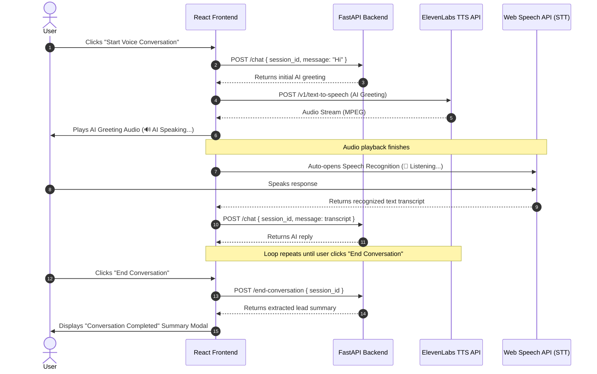

# AI Real Estate Voice Agent

An enterprise-grade, voice-first AI Real Estate Sales Assistant that conducts hands-free, natural voice conversations to qualify real estate leads, collect buyer specifications, answer property inquiries, and summarize client requirements.

🌐 **Live Application**: [real-estate-voiceagent.vercel.app](https://real-estate-voiceagent.vercel.app)

---

## 🌟 Key Features

- 🎤 **Hands-Free Voice Conversation Loop**: Continuous turn-taking voice interface powered by Web Speech API (STT) and ElevenLabs (TTS).
- 🔊 **ElevenLabs Text-to-Speech**: High-fidelity vocalization using the `eleven_multilingual_v2` model, naturally supporting English, Hindi, and Hinglish.
- 📋 **Automated Lead Qualification**: AI automatically extracts buyer requirements including **Property Type, Location, Budget, Purpose, Timeline, Phone Number, and Email**.
- 📑 **Customer-Facing Summary Card**: Generates a read-only requirements card at the end of every conversation for client review.
- 📝 **Markdown-Rendered Chat Timeline**: Formatted AI responses with bold text, lists, and clean typography via `react-markdown`.
- ⌨️ **Voice & Text Dual Modes**: Seamless fallback to text mode for manual inspection or silent input.

---

## 🏗️ Architecture & Conversational Workflow



---

## 🛠️ Technology Stack

### Frontend
- **Framework**: React 19 + Vite
- **Styling**: Tailwind CSS
- **Icons**: React Icons (`hi2`)
- **HTTP Client**: Axios
- **Markdown**: React Markdown

### Speech & AI Integration
- **Speech-to-Text (STT)**: Web Speech API (`window.SpeechRecognition`)
- **Text-to-Speech (TTS)**: ElevenLabs API (`eleven_multilingual_v2` model)
- **LLM & Lead Extraction**: Groq API

### Backend
- **Framework**: FastAPI (Python)
- **ASGI Server**: Uvicorn
- **Data Validation**: Pydantic
- **CORS Management**: FastAPI `CORSMiddleware`

---

## 🚀 Environment & Setup

### 1. Environment Variables

Create `.env` files for both frontend and backend:

#### Frontend (`frontend/.env`)
```env
VITE_ELEVEN_LABS_API_KEY=your_elevenlabs_api_key
VITE_ELEVEN_LABS_VOICE_ID=your_elevenlabs_voice_id
```

#### Backend (`backend/.env`)
```env
GROQ_API_KEY=your_groq_api_key
MODEL_NAME=openai/gpt-oss-120b
```

---

### 2. Backend Setup & Local Execution

```bash
# Navigate to backend directory
cd backend

# Activate virtual environment
# Windows (PowerShell):
.\estate\Scripts\Activate.ps1

# Install Python dependencies
pip install -r requirements.txt

# Run FastAPI backend server on http://127.0.0.1:8000
uvicorn app.main:app --reload
```

---

### 3. Frontend Setup & Local Execution

```bash
# Navigate to frontend directory
cd frontend

# Install Node dependencies
npm install

# Run Vite dev server on http://localhost:5173
npm run dev

# Build for production
npm run build
```

---

## 🔗 Live Application Link

You can access the live, deployed web application here:

👉 **[https://real-estate-voiceagent.vercel.app](https://real-estate-voiceagent.vercel.app)**
